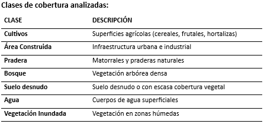
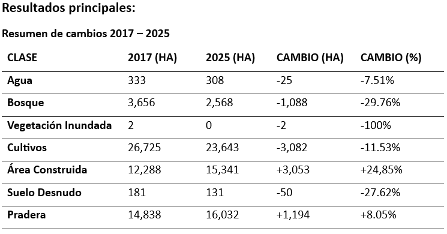
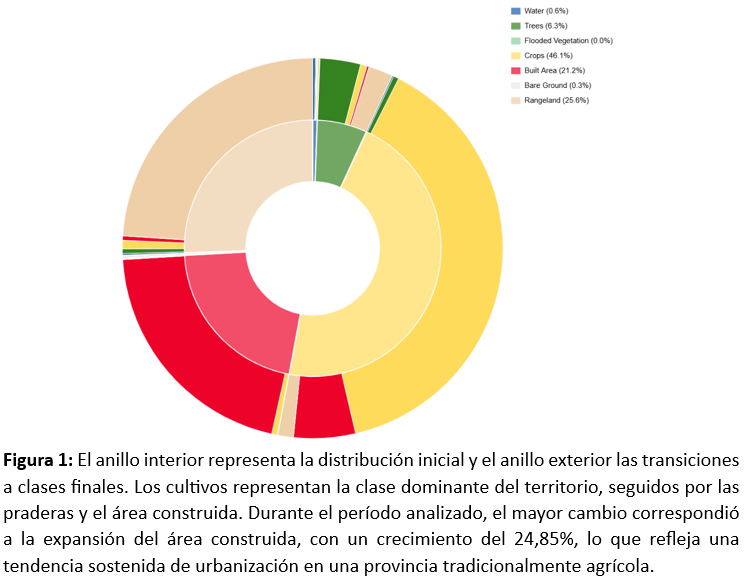

ANÁLISIS DE CAMBIO DE COBERTURA DE SUELO - TALAGANTE, CHILE (2017 – 2025)

Herramientas: EarthMap (FAO) 

Datos: ESRI 10m Cobertura Terrestre (Sentinel-2)

Período:  2017 – 2025

Resolución espacial: 10 metros

Autora: María José Plana S. | Ingeniera Agrónoma

Contexto:

Talagante es una provincia tradicionalmente agrícola ubicada en la Región Metropolitana de Santiago, Chile. En las últimas décadas ha experimentado una fuerte presión urbanística derivada del crecimiento de Santiago hacia la periferia rural.
Este análisis utiliza la capa ESRI 10m Cobertura Terrestre Anual - un producto global de alta resolución generado mediante deep learning sobre imágenes satelitales Sentinel-2 - para cuantificar los cambios en el uso del suelo entre 2017 y 2025, con foco en la conversión de suelo agrícola a área urbana.

				

Figura 1: El anillo interior representa la distribución inicial y el anillo exterior las transiciones a clases finales. Los cultivos representan la clase dominante del territorio, seguidos por las praderas y el área construida. Durante el período analizado, el mayor cambio correspondió a la expansión del área construida, con un crecimiento del 24,85%, lo que refleja una tendencia sostenida de urbanización en una provincia tradicionalmente agrícola.

Análisis e Interpretación:

1.	Expansión urbana sostenida:
El área construida creció de 12.288 ha a 15.341 ha entre 2017 y 2025, representando un aumento del 24,85% en 8 años. Este crecimiento equivale a aproximadamente 3.053 hectáreas nuevas de infraestructura urbana e industrial.

2.	Pérdida de suelo agrícola:
Las superficies de cultivo disminuyeron en 3.082 ha (-11,53%), pasando de 26.725 ha a 23.643 ha. La coincidencia casi exacta entre la pérdida agrícola (+3.082 ha) y la ganancia urbana (+3.053 ha) sugiere una conversión directa de suelo agrícola productivo en área edificada, lo que representa una amenaza concreta para la seguridad alimentaria local y el patrimonio agrícola de la provincia.

3.	Pérdida de cobertura arbórea: 
La vegetación arbórea disminuyó en 1.088 ha (-29,76%), aunque con fluctuaciones interanuales que pueden reflejar variaciones en cultivos perennes o esfuerzos de reforestación locales.

4.	Expansión de matorrales: 
La pradera aumentó levemente (+8,05%), posiblemente como consecuencia del abandono de tierras agrícolas marginales antes de su eventual urbanización.

Recursos:

•	[ESRI 10m Land Cover – Documentación](https://www.arcgis.com/home/item.html?id=cfcb7609de5f478eb7666240902d4d3d)

•	[EarthMap FAO](https://earthmap.org)

